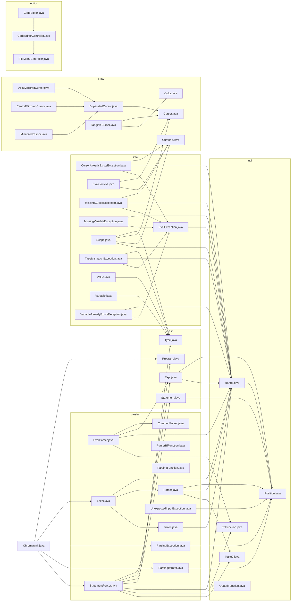

  <h1>Chromatynk</h1>

*Chromatynk* allows users to draw arbitrary shapes on a canvas using simple instructions, such as moving forward by a certain number of pixels or turning by a specific angle.

Users can customize the thickness and color of the lines drawn. The program includes a custom instruction language and an interpreter to process these instructions. Additionally, it features the ability to save and load creations, and renders the drawings in **real-time**.

### Made by

  
 |  |  |  |  | |
 | --- | --- | --- | --- | --- |
 | [Iltotore](https://github.com/Iltotore) | [JordanViknar](https://github.com/JordanViknar) | [gorosumo](https://github.com/gorosumo) | [LiliRoseGicquel](https://github.com/LiliRoseGicquel) | [Harruki2k](https://github.com/Harruki2k) |

## Features

| | Support |
| --- | --- |
| Performs unit drawing instructions | ? |
| Shows results | ? |
| Open & save files | ? |
| Save canvasses | ? |
| Choose draw speed | ? |
| Step-by-step mode | ? |
| Proper error management | ? |
| Parallel cursors | ? |
| Tab system | ? |

## How to build

### Compile-time dependencies

### Instructions

## How to run

### Runtime dependencies

### Instructions

## Architecture (file dependency tree)
*(Note : This tree does not include external dependencies.)*

