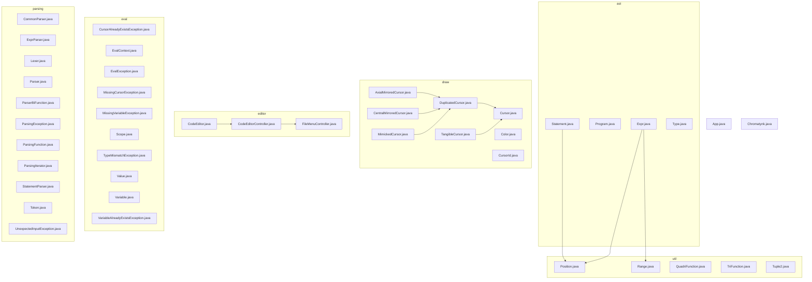

  <h1>Chromatynk</h1>

## Contributors

  
 |  |  |  |  | |
 | --- | --- | --- | --- | --- |
 | [Iltotore](https://github.com/Iltotore) | [JordanViknar](https://github.com/JordanViknar) | [gorosumo](https://github.com/gorosumo) | [LiliRoseGicquel](https://github.com/LiliRoseGicquel) | [Harruki2k](https://github.com/Harruki2k) |

## Summary

## Features

## How to build

## How to run

## Architecture

