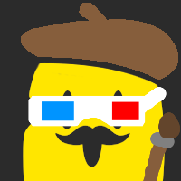

<div align="center">
  <h1> Chromat'ynk</h1>
</div>

*Chromat'ynk* allows users to draw arbitrary shapes on a canvas using simple instructions, such as moving forward by a certain number of pixels or turning by a specific angle.

Users can customize the thickness and color of the lines drawn. The program includes a custom instruction language and an interpreter to process these instructions. Additionally, it features the ability to save and load creations, and renders the drawings in **real-time**.

### Made by

<div style="width: 75%; margin: 0 auto;" align="center">
  
 |  |  |  |  | |
 | --- | --- | --- | --- | --- |
 | [Iltotore](https://github.com/Iltotore) | [JordanViknar](https://github.com/JordanViknar) | [gorosumo](https://github.com/gorosumo) | [LiliRoseGicquel](https://github.com/LiliRoseGicquel) | [Harruki2k](https://github.com/Harruki2k) |
</div>

## Features

<div style="width: 75%; margin: 0 auto;" align="center">

| | Support |
| --- | --- |
| Performs unit drawing instructions | ✅ |
| Shows results | ✅ |
| Open & save files | ✅ |
| Save canvasses | ✅ |
| Choose draw speed | ✅ |
| Step-by-step mode | ✅ |
| Proper error management | ✅ |
| Parallel cursors | ✅ |
| Tab system | ✅ |
</div>

## How to build

### Instructions

Chromat'ynk requires Java 21 or later, due to the usage of pattern matching and `record`.

First, clone the project with `git` :

```bash
git clone https://github.com/cytech-ing1-gi22/chromatynk
```

Then simply run this command, which uses the bundled *maven* wrapper (or you can use your existing `mvn` installation instead) :

| Linux | Windows |
| --- | --- | 
| ```./mvnw package``` | ```mvnw.cmd package``` |

This command will package the application into a `.jar` file, which you can easily run at any time.

## How to run

*(Note : running the application also requires Java 21 or later. The application has been successfully tested on GraalVM and OpenJDK.)*

### Instructions

Assuming you cloned the repo already, you can :
- Follow the build instructions and then run the packaged `.jar` file with your favorite Java 21-compatible JVM.
- Use this command to run directly from the root folder :

| Linux | Windows |
| --- | --- |
| ```./mvnw javafx:run``` | ```mvnw.cmd javafx:run``` |

*(You can replace `./mvwn` and `mvnw.cmd` with an existing *maven* installation.)*

## Architecture
*(Note : This tree does not include external libraries.)*

```mermaid
classDiagram
direction BT
class App {
  + App() 
  + main(String[]) void
  + start(Stage) void
}
class AxialMirroredCursor {
  + AxialMirroredCursor(Cursor, double, double) 
  - getSymmetricX(double, double) double
  + drawLineAt(GraphicsContext, double, double, double, double) void
  - getSymmetricY(double, double) double
}
class CentralMirroredCursor {
  + CentralMirroredCursor(Cursor, double, double) 
  + drawLineAt(GraphicsContext, double, double, double, double) void
  - getSymmetricY(double) double
  - getSymmetricX(double) double
}
class Chromatynk {
  + Chromatynk() 
  + parseProgram(String) Program
}
class CodeEditor {
  + CodeEditor() 
  + start(Stage) void
  + main(String[]) void
}
class CodeEditorController {
  + CodeEditorController(Stage) 
  + openFile() void
  + quit() void
  + initialize() void
  + saveFile() void
  + clearTextArea() void
  + runScript() void
}
class Color {
  + Color(double, double, double) 
  + green() double
  + toANSI() String
  + blue() double
  - distanceSquaredTo(Color) double
  + red() double
   double blueProjection
   double redProjection
   double brightness
}
class CommonParser {
  + CommonParser() 
  + tokenOf(Class~T~) Parser~Token, T~
  + anyToken() Parser~Token, Token~
}
class Cursor {
<<Interface>>
  + copyTangible() Cursor
  + drawLineAt(GraphicsContext, double, double, double, double) void
  + move(GraphicsContext, double, double) void
   double opacity
   Color color
   double y
   double dirY
   double dirX
   double x
   double thickness
}
class CursorAlreadyExistsException {
  + CursorAlreadyExistsException(Range, CursorId) 
}
class CursorId {
<<Interface>>
   String stringId
}
class DuplicatedCursor {
  + DuplicatedCursor(Cursor) 
   Cursor duplicated
   double opacity
   Color color
   double y
   double dirY
   double dirX
   double x
   double thickness
}
class EvalContext {
  + EvalContext(Scope, CursorId) 
   Scope scope
   Cursor currentCursor
   CursorId currentCursorId
}
class EvalException {
  + EvalException(Range, String) 
   Range range
}
class Expr {
<<Interface>>
  + range() Range
}
class ExprParser {
  + ExprParser() 
  - parseHexColor(Range, String) LiteralColor
  + arithmeticOperator() Parser~Token, Expr~
  + booleanOperator() Parser~Token, Expr~
  + invokable() Parser~Token, Expr~
  + prefixOperator() Parser~Token, Expr~
  + parenthesized() Parser~Token, Expr~
  - parseColorComponent(String, double) double
  + literal() Parser~Token, Expr~
  + multiplicationOperator() Parser~Token, Expr~
  + unaryOperator() Parser~Token, Expr~
  - parseUnaryOperator(Operator, Expr, String, Map~String, BiFunction~Range, Expr, Expr~~) Expr
  + varCall() Parser~Token, Expr~
  + anyExpr() Parser~Token, Expr~
  - binaryOperatorParser(Parser~Token, Expr~, String, Map~String, TriFunction~Range, Expr, Expr, Expr~~) Parser~Token, Expr~
  + comparisonOperator() Parser~Token, Expr~
  + suffixOperator() Parser~Token, Expr~
}
class FileMenuController {
  + FileMenuController(Stage, TextArea) 
  + openFile() void
  + saveFile() void
}
class Lexer {
  + Lexer() 
}
class MimickedCursor {
  + MimickedCursor(Cursor, double, double) 
  + drawLineAt(GraphicsContext, double, double, double, double) void
  + at(Cursor, double, double) MimickedCursor
}
class MissingCursorException {
  + MissingCursorException(Range, CursorId) 
}
class MissingVariableException {
  + MissingVariableException(Range, String) 
}
class Parser~I, O~ {
<<Interface>>
  + optional() Parser~I, Optional~O~~
  + repeatReduce(Parser~I, BiFunction~O, O, O~~) Parser~I, O~
  + mapWithRange(ParsingBiFunction~Range, O, T~) Parser~I, T~
  + debug(String) Parser~I, O~
  + matching(String) Parser~Character, String~
  + anyOf(T[]) Parser~T, T~
  + pure(O) Parser~I, O~
  + firstSucceeding(Iterable~Parser~I, O~~) Parser~I, O~
  + zip(Parser~I, O2~) Parser~I, Tuple2~O, O2~~
  + anyOfSet(Set~T~) Parser~T, T~
  + suffixed(Parser~I, ?~) Parser~I, O~
  + keyword(String) Parser~Character, String~
  + mapError(Function~ParsingException, ParsingException~) Parser~I, O~
  + parse(ParsingIterator~I~) Result~O~
  + valueWithRange(ParsingFunction~Range, T~) Parser~I, T~
  + map(ParsingFunction~O, T~) Parser~I, T~
  + any() Parser~T, T~
  + firstSucceeding(Parser~I, O~[]) Parser~I, O~
  + prefixed(Parser~I, ?~) Parser~I, O~
  + symbol(String) Parser~Character, String~
  + repeat() Parser~I, List~O~~
  + lazy(Supplier~Parser~I, O~~) Parser~I, O~
  + fatal() Parser~I, O~
}
class ParsingBiFunction~I1, I2, O~ {
<<Interface>>
  + apply(I1, I2) O
}
class ParsingException {
  - ParsingException(Position, String) 
   Position position
}
class ParsingFunction~I, O~ {
<<Interface>>
  + apply(I) O
}
class ParsingIterator~T~ {
  + ParsingIterator(List~T~) 
  + ParsingIterator(List~T~, int, Position, Predicate~T~, Predicate~T~) 
  + forEachRemainingKeepWhitespaces(Consumer~T~) void
  + copy() ParsingIterator~T~
  + nextKeepWhitespaces() T
  + handleWhitespaces() void
  + fromString(String) ParsingIterator~Character~
  + peek() T
  + of(T[]) ParsingIterator~T~
  + hasNext() boolean
  + next() T
   int cursor
   Position position
   List~T~ input
}
class Position {
  + Position(int, int) 
  + column() int
  + min(Position, Position) Position
  + nextRow() Position
  + max(Position, Position) Position
  + nextColumn() Position
  + row() int
}
class Program {
  + Program(List~Statement~) 
  + statements() List~Statement~
}
class QuadriFunction~I1, I2, I3, I4, R~ {
<<Interface>>
  + apply(I1, I2, I3, I4) R
}
class Range {
  + Range(Position, Position) 
  + sameLine(int, int) Range
  + to() Position
  + merge(Range) Range
  + sameLine(int, int, int) Range
  + from() Position
}
class Scope {
  + Scope(Scope, Map~String, Variable~, Map~CursorId, Cursor~) 
  + getDirectVariable(String) Optional~Variable~
  + containsVariable(String) boolean
  + getType(String) Optional~Type~
  + getCursor(CursorId) Optional~Cursor~
  + declareCursor(CursorId, Cursor, Range) void
  + setValue(String, Value, Range) void
  + declareVariable(String, Variable, Range) void
  + toString() String
  + getDirectCursor(CursorId) Optional~Cursor~
  + getValue(String) Optional~Value~
  + deleteVariable(String, Range) void
  + containsCursor(CursorId) boolean
  + deleteCursor(CursorId, Range) void
  + getVariable(String) Optional~Variable~
   Optional~Scope~ parent
}
class Statement {
<<Interface>>
  + range() Range
}
class StatementParser {
  + StatementParser() 
  + anyStatement() Parser~Token, Statement~
  + instruction() Parser~Token, Statement~
  + variableAssignment() Parser~Token, Statement~
  + program() Parser~Token, Program~
  + twoArgs() Parser~Token, Statement~
  + zeroArg() Parser~Token, Statement~
  + variableDeclaration() Parser~Token, Statement~
  + threeArgs() Parser~Token, Statement~
  + body() Parser~Token, Body~
  + type() Parser~Token, Tuple2~Range, Type~~
  + forLoop() Parser~Token, Statement~
  + oneArg() Parser~Token, Statement~
  + ifCondition() Parser~Token, Statement~
  + whileLoop() Parser~Token, Statement~
}
class TangibleCursor {
  + TangibleCursor(double, double, double, double, Color, double, double) 
  + TangibleCursor(double, double) 
  + drawLineAt(GraphicsContext, double, double, double, double) void
   double opacity
   Color color
   double y
   double dirY
   double dirX
   double x
   double thickness
}
class Token {
<<Interface>>
  + range() Range
}
class TriFunction~I1, I2, I3, R~ {
<<Interface>>
  + apply(I1, I2, I3) R
}
class Tuple2~A, B~ {
  + Tuple2(A, B) 
  + a() A
  + b() B
}
class Type {
<<enumeration>>
  - Type(String) 
  + fromName(String) Optional~Type~
  + values() Type[]
  + valueOf(String) Type
   String name
}
class TypeMismatchException {
  + TypeMismatchException(Range, Type, Type) 
}
class UnexpectedInputException {
  + UnexpectedInputException(Position, String, String) 
  + anyOf(Position, Set~T~, String) UnexpectedInputException
  + anyOfValue(Position, Set~T~, T) UnexpectedInputException
   String actual
   String expected
}
class Value {
<<Interface>>
   Type type
}
class Variable {
  + Variable(Type) 
  + Variable(Type, Value) 
  + toString() String
   Optional~Value~ value
   Type type
}
class VariableAlreadyExistsException {
  + VariableAlreadyExistsException(Range, String) 
}

AxialMirroredCursor  -->  DuplicatedCursor 
CentralMirroredCursor  -->  DuplicatedCursor 
Chromatynk  ..>  ParsingIterator~T~ : «create»
CodeEditor  ..>  CodeEditorController : «create»
CodeEditorController  ..>  FileMenuController : «create»
CodeEditorController "1" *--> "fileMenuController 1" FileMenuController 
CommonParser  ..>  UnexpectedInputException : «create»
Cursor  ..>  TangibleCursor : «create»
CursorAlreadyExistsException  -->  EvalException 
DuplicatedCursor  ..>  Cursor 
DuplicatedCursor "1" *--> "duplicated 1" Cursor 
EvalContext "1" *--> "currentCursorId 1" CursorId 
EvalContext "1" *--> "scope 1" Scope 
EvalException "1" *--> "range 1" Range 
ExprParser "1" *--> "BOOLEAN_OPS *" TriFunction~I1, I2, I3, R~ 
ExprParser  ..>  UnexpectedInputException : «create»
Lexer "1" *--> "LITERAL_BOOL_PARSER 1" Parser~I, O~ 
Lexer  ..>  UnexpectedInputException : «create»
MimickedCursor  -->  DuplicatedCursor 
MissingCursorException  -->  EvalException 
MissingVariableException  -->  EvalException 
Parser~I, O~  ..>  Range : «create»
Parser~I, O~  ..>  Tuple2~A, B~ : «create»
Parser~I, O~  ..>  UnexpectedInputException : «create»
ParsingException "1" *--> "position 1" Position 
ParsingIterator~T~ "1" *--> "position 1" Position 
ParsingIterator~T~  ..>  Position : «create»
Program "1" *--> "statements *" Statement 
Range  ..>  Position : «create»
Range "1" *--> "from 1" Position 
Scope "1" *--> "directCursors *" Cursor 
Scope  ..>  CursorAlreadyExistsException : «create»
Scope "1" *--> "directCursors *" CursorId 
Scope  ..>  MissingCursorException : «create»
Scope  ..>  MissingVariableException : «create»
Scope  ..>  TypeMismatchException : «create»
Scope "1" *--> "directVariables *" Variable 
Scope  ..>  VariableAlreadyExistsException : «create»
StatementParser "1" *--> "THREE_ARG_STATEMENTS *" QuadriFunction~I1, I2, I3, I4, R~ 
StatementParser "1" *--> "TWO_ARG_STATEMENTS *" TriFunction~I1, I2, I3, R~ 
StatementParser  ..>  Tuple2~A, B~ : «create»
StatementParser  ..>  UnexpectedInputException : «create»
TangibleCursor  ..>  Color : «create»
TangibleCursor "1" *--> "color 1" Color 
TangibleCursor  ..>  Cursor 
TypeMismatchException  -->  EvalException 
UnexpectedInputException  -->  ParsingException 
Variable "1" *--> "type 1" Type 
Variable "1" *--> "value 1" Value 
VariableAlreadyExistsException  -->  EvalException 
```


